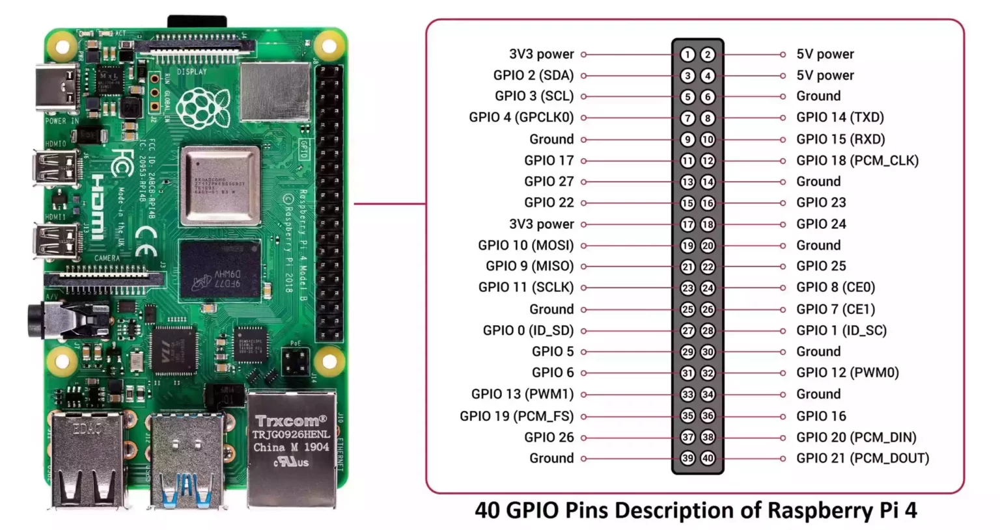

# Yocto-based BSP for Raspberry Pi 4B
This repository provides a Yocto-based Board Support Package (BSP) for the Raspberry Pi 4B. It includes the necessary configurations and recipes to build a minimal Linux image for the Raspberry Pi 4B using the Yocto Project.

## Cloning the repository

```Bash
# Clone with submodules (Use -j X to parallelize the cloning process)
git clone --recurse-submodules git@github.com:CaglayanDokme/rpi4b-yocto.git
```

## Building the BSP
Building the BSP is quite straightforward. The build process will take a while, especially the first time, as it needs to download and compile all the necessary components. The downloaded sources will be cached, so subsequent builds will be faster. See `DL_DIR` and `SSTATE_DIR` in [`conf/local.conf`](conf/local.conf) for the locations of the downloaded sources and shared state cache.

```Bash
# Initialize the build environment
source poky/oe-init-build-env

# Start the build, the first build will take long (~2 hours)
bitbake core-image-minimal
```

## Deploying the image
Using an helper script, you can deploy the images found in `build/tmp/deploy/images/raspberrypi4-64/` to your SD card. This script can also format the SD card if required.

```Bash
bash scripts/deploy-to-sd.sh --device <device-node> --allow-format
```

## Boot

### Command Line Serial Interface
Use GPIO 14-15 for serial connection. The baud rate will be 115200 bps by default.

### Boot Sequence
The Raspberry Pi's boot process is primarily handled by the **VideoCore GPU**, not the ARM CPU directly, at the very beginning. This is a key differentiator from many other embedded Linux systems.

- **Stage 0: On-Chip ROM Bootloader (GPU)**
    - When you power on the Raspberry Pi, the first code that runs is a small, immutable bootloader stored in the GPU's **Read-Only Memory (ROM)**.
    - This ROM bootloader's primary job is to initialize minimal hardware and then look for the `bootcode.bin` file on the SD card. It specifically looks for this file at fixed offsets (sectors) on the card, which is why having that **1MB spare area** before your first partition (the BOOT partition) is crucial. This spare area ensures `bootcode.bin` and potentially other very early boot data can reside there without interfering with the partition table.
- **Stage 1: `bootcode.bin` (First Stage Bootloader)**
    - The ROM bootloader loads `bootcode.bin` from the SD card into the GPU's L2 cache and executes it.
    - `bootcode.bin` is a very small, proprietary binary firmware. Its main purpose is to initialize the SDRAM (main memory) and then load the next stage of the boot process, which is the main VideoCore GPU firmware.
- **Stage 2: `start*.elf` and `fixup*.dat` (VideoCore GPU Firmware)**
    - `bootcode.bin` loads `start*.elf` (e.g., `start4.elf` for RPi4) and its accompanying data files (`fixup*.dat` - e.g., `fixup4.dat`) from the **FAT32 BOOT partition** of your SD card into memory.
    - This `start*.elf` file is the primary GPU firmware. It's a complex piece of proprietary software that handles most of the low-level hardware initialization:
        - It reads the `config.txt` file from the BOOT partition. This is where your recent fix was crucial. See the [documentation](https://www.raspberrypi.com/documentation/computers/config_txt.html).
        - It then loads the Linux kernel image (`Image`) and the Device Tree Blob (`.dtb`) into the ARM CPU's RAM.
        - It processes the `cmdline.txt` file, passing these arguments as the kernel command line to the Linux kernel.
        - Finally, it "hands over" control to the ARM CPU by jumping to the kernel's entry point.
- **Stage 3: Linux Kernel (ARM CPU)**
- **Stage 4: Userspace initialization from RootFS (ARM CPU)**

---

